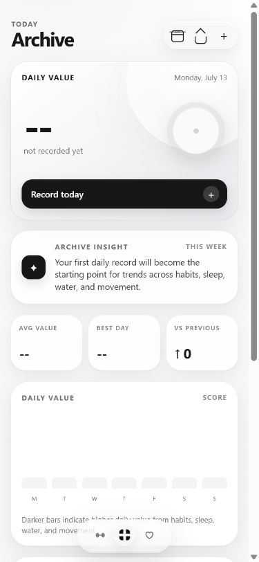

# Archive

Archive is a private-first personal productivity, health, and workout tracker. It combines daily habits, hydration, sleep, workout planning, workout history, and an approval-based AI coach in one compact interface.



## Highlights

- Daily habit, water, and sleep tracking
- Curated Today and metric story pages with optional pinned panels
- Purposeful chart, progress, page, and interaction motion with reduced-motion support
- Weekly workout scheduling and editable routines
- Exercise library with equipment and build-focus profiles
- Detailed workout logging and monthly workout history
- Gemini-powered coaching with reviewable changes
- Local JSON backup and restore
- Canonical Health Connect archive with automatic lifecycle/background refresh, source provenance, reconciliation, and watch-first sleep precedence
- Android packaging through Capacitor

## Privacy

Archive stores app state and the optional Gemini API key locally on the device. API keys are not hard-coded into the project or included in Archive JSON backups.

Do not commit personal backup exports, browser profiles, local Android configuration, or environment files.

## Tech stack

- React 19
- Vite 7
- Capacitor 7
- Android Studio and Gradle
- Browser `localStorage`
- Google Gemini API

## Run locally

Requirements:

- Node.js
- npm

```powershell
npm install
npm run dev
```

Vite prints the local development URL in the terminal.

## Build the web app

```powershell
npm run build
```

## Build the Android debug APK

```powershell
npm run build
npx cap sync android
cd android
.\gradlew.bat assembleDebug
```

The APK is generated at:

```text
android/app/build/outputs/apk/debug/app-debug.apk
```

## Versioned releases

Archive uses semantic pre-release versions recorded in [`VERSION`](VERSION). To build and preserve the current version locally and in Google Drive, run:

```powershell
npm run release:build
```

The release script refuses to overwrite an existing version. Release notes and APK locations are indexed in [`RELEASES.md`](RELEASES.md), while user-facing changes are maintained in [`CHANGELOG.md`](CHANGELOG.md).

## Data model

Archive does not generate simulated history for new users. Daily records and completed workouts are persisted only after user actions. A workout enters history only after **Finish workout** is selected.

Health Connect data is normalized into one local, versioned health archive. Archive refreshes on launch and resume, while separately approved Android background access enables inexact hourly snapshots. Recent syncs reconcile authoritative daily totals, sleep sessions, and workouts—including corrections and deletions—while high-frequency heart-rate and HRV data use a bounded rolling sample window. Each imported record retains provider, source, timezone, and import provenance.

## Project status

Archive is an actively developed personal application. The repository contains the web source and Android project, but excludes generated builds and private local data.
